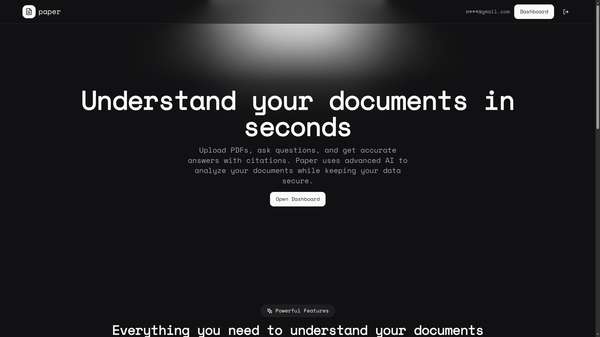
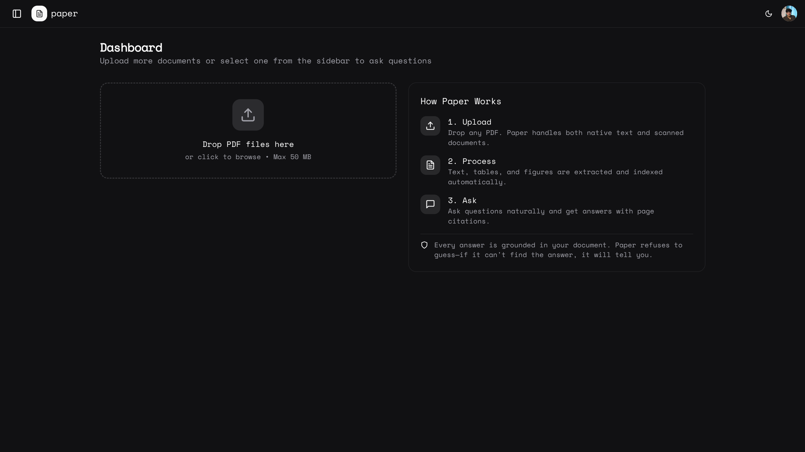
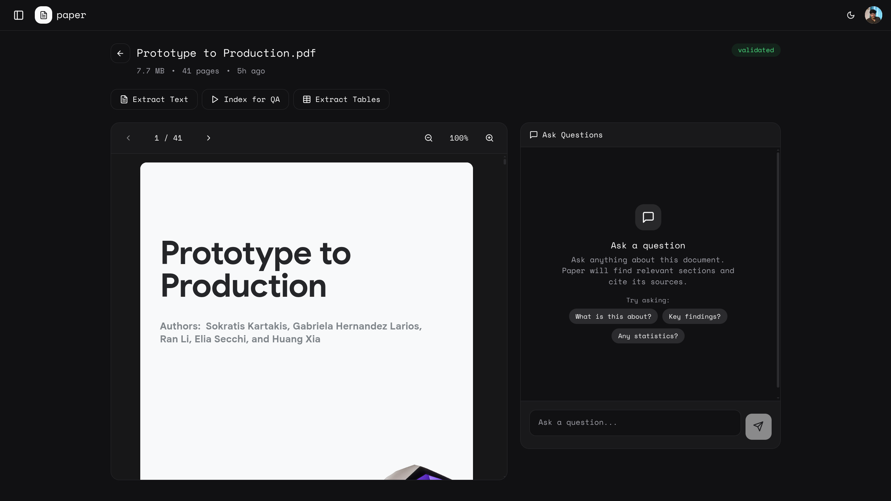
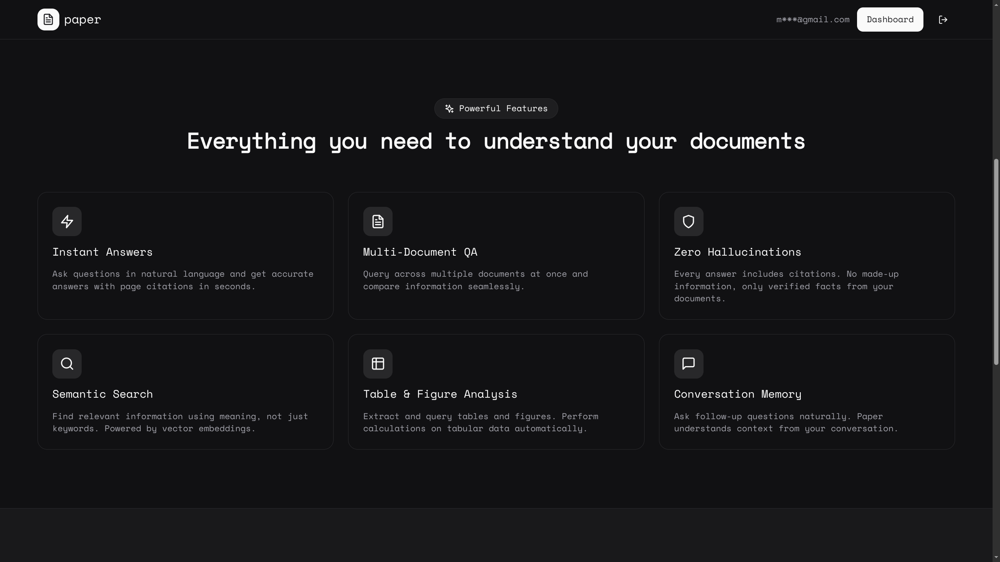
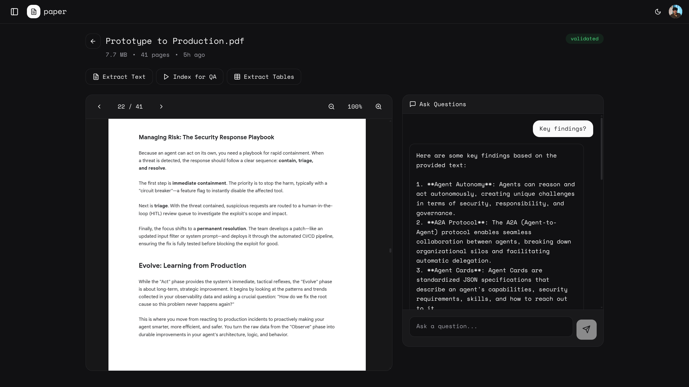

# Paper

**Paper is a multimodal document intelligence system that turns PDFs into verifiable answers with citations—so you can trust what the AI says.**

Upload any PDF, ask questions in plain English, and get accurate answers with page-level citations. Paper extracts text, tables, and figures, then uses retrieval-augmented generation (RAG) to answer questions based solely on your document content. No hallucinations—if Paper can't find the answer, it tells you.


### **Landing Page**


### **Dashboard**


### **Screenshots**




## Why Paper Exists

PDFs are everywhere—research papers, financial reports, legal documents, technical manuals. But finding specific information in a 100-page document is painful. Traditional search finds keywords, not meaning. And while LLMs can answer questions, they often hallucinate facts that sound plausible but aren't in the document.

Paper solves this by:
- **Grounding every answer in source content** — answers come from your document, not the model's training data
- **Providing page-level citations** — click any citation to verify the source
- **Refusing to guess** — if the information isn't found, Paper says so instead of making things up

## What Makes Paper Different

| Traditional LLMs | Paper |
|-----------------|-------|
| May hallucinate facts | Every claim has a citation |
| Uses training data | Uses only your document |
| No source verification | Click to jump to source page |
| Confident even when wrong | Shows confidence scores |
| Text only | Understands tables and figures |

## Features

- **PDF Processing**: Native text extraction and OCR for scanned documents
- **Semantic Search**: Find information by meaning, not just keywords
- **Question Answering**: Natural language questions with cited answers
- **Multi-Document QA**: Query across multiple documents at once
- **Table Extraction**: Automatic table detection and structured data extraction
- **Figure Analysis**: Chart and diagram understanding via vision models
- **Confidence Scoring**: Know how well-supported each answer is
- **Conversation Memory**: Ask follow-up questions naturally

## System Architecture

```
┌─────────────────────────────────────────────────────────────────────┐
│                           Frontend (Next.js)                        │
│  ┌──────────┐  ┌──────────┐  ┌──────────┐  ┌──────────────────────┐ │
│  │  Upload  │  │   Chat   │  │   PDF    │  │  Table/Figure View   │ │
│  │  Panel   │  │  Panel   │  │  Viewer  │  │                      │ │
│  └──────────┘  └──────────┘  └──────────┘  └──────────────────────┘ │
└─────────────────────────────────────────────────────────────────────┘
                                    │
                                    ▼
┌─────────────────────────────────────────────────────────────────────┐
│                          Backend (FastAPI)                          │
│  ┌──────────────────────────────────────────────────────────────┐   │
│  │                         API Routes                           │   │
│  │  /upload  /extract  /index  /search  /ask  /tables  /figures │   │
│  └──────────────────────────────────────────────────────────────┘   │
│                                    │                                │
│  ┌─────────────┐  ┌─────────────┐  │  ┌─────────────────────────┐   │
│  │   Text      │  │   Table     │  │  │      QA Engine          │   │
│  │  Extractor  │  │  Extractor  │  │  │  (RAG + Citations)      │   │
│  │  (PyMuPDF   │  │  (Camelot   │  │  │                         │   │
│  │   + OCR)    │  │  pdfplumber)│  │  └─────────────────────────┘   │
│  └─────────────┘  └─────────────┘  │                                │
└─────────────────────────────────────────────────────────────────────┘
                                    │
                    ┌───────────────┼───────────────┐
                    ▼               ▼               ▼
             ┌──────────┐   ┌──────────┐   ┌──────────┐
             │PostgreSQL│   │  Qdrant  │   │  Ollama  │
             │(Supabase)│   │ (Vectors)│   │  (LLM)   │
             └──────────┘   └──────────┘   └──────────┘
```

## How It Works

### 1. Upload & Extract
When you upload a PDF, Paper:
- Validates the file (checks for corruption, password protection)
- Extracts text from each page (native text or OCR for scanned pages)
- Detects and extracts tables using multiple extraction methods
- Identifies figures and charts for visual analysis

### 2. Chunk & Index
The extracted content is:
- Split into semantic chunks (500-800 tokens with overlap)
- Converted to vector embeddings using `nomic-embed-text`
- Stored in Qdrant for fast similarity search
- Linked back to source pages for citation

### 3. Retrieve & Answer
When you ask a question:
- Your question is embedded using the same model
- Similar chunks are retrieved from the vector database
- Retrieved context is assembled with page references
- The LLM generates an answer using only the provided context
- Citations are validated against retrieved chunks
- If citations are invalid, the answer is regenerated

### 4. Verify
Every answer includes:
- Page-level citations (e.g., [Page 5], [Pages 12-14])
- Confidence score based on retrieval quality
- Source type indicators (text, table, figure)
- Click-to-navigate to source pages

## Tech Stack

| Layer | Technology | Purpose |
|-------|------------|---------|
| **Frontend** | Next.js 14, React 18, Tailwind CSS | Modern, responsive UI |
| **Auth** | Clerk | OAuth authentication |
| **Backend** | FastAPI, Python 3.11 | Async REST API |
| **Database** | PostgreSQL (Supabase) | Document metadata, audit trail |
| **Vector DB** | Qdrant | Semantic search |
| **Cache** | Redis | Session management |
| **LLM** | Ollama (Llama 3.1 8B) | Answer generation |
| **Embeddings** | nomic-embed-text | Vector embeddings |
| **OCR** | Tesseract | Scanned document support |
| **PDF** | PyMuPDF, Camelot, pdfplumber | Text and table extraction |

## Quick Start

### Prerequisites
- Docker and Docker Compose v2
- Supabase account (for PostgreSQL)
- Ollama running locally with `llama3.1:8b` and `nomic-embed-text`

### 1. Clone and Configure

```bash
git clone https://github.com/MitudruDutta/paper.git
cd paper
cp .env.example .env
# Edit .env with your Supabase credentials
```

### 2. Start Services

```bash
# Start backend services
docker compose -f infrastructure/docker-compose.yml up --build -d

# Start Ollama (if not already running)
OLLAMA_HOST=0.0.0.0 ollama serve &
ollama pull llama3.1:8b
ollama pull nomic-embed-text
```

### 3. Start Frontend

```bash
cd frontend
npm install
npm run dev
```

### 4. Open Paper

Navigate to `http://localhost:3000` and sign in to start using Paper.

## Demo Walkthrough

### Upload a Document
1. Click "Upload Document" or drag a PDF onto the upload area
2. Wait for processing (extraction + indexing takes a few seconds)
3. You'll be redirected to the document view

### Ask Questions
Try these sample questions:
- "What is the main topic of this document?"
- "Summarize the key findings"
- "What data or statistics are mentioned?"
- "Are there any recommendations?"

### Verify Answers
- Check the confidence score (High/Medium/Low)
- Click "X sources" to see citations
- Click any citation badge to jump to that page
- Use the PDF viewer to verify the source

### Multi-Document Queries
1. Upload multiple related documents
2. Select documents from the sidebar
3. Ask comparative questions like "How do these reports differ?"

## API Reference

| Endpoint | Method | Description |
|----------|--------|-------------|
| `/documents/upload` | POST | Upload a PDF |
| `/documents` | GET | List all documents |
| `/documents/{id}` | GET | Get document details |
| `/documents/{id}/extract-text` | POST | Extract text |
| `/documents/{id}/index` | POST | Index for search |
| `/documents/{id}/extract-visuals` | POST | Extract tables/figures |
| `/search` | POST | Semantic search |
| `/ask` | POST | Ask a question |
| `/documents/{id}/tables` | GET | List extracted tables |
| `/documents/{id}/figures` | GET | List extracted figures |
| `/health` | GET | Health check |

## Configuration

### Environment Variables

```bash
# Database (required)
SUPABASE_DB_HOST=your-project.supabase.co
SUPABASE_DB_PASSWORD=your-password

# Services (defaults work for Docker)
REDIS_HOST=redis
QDRANT_HOST=qdrant

# LLM
OLLAMA_HOST=host.docker.internal
OLLAMA_MODEL=llama3.1:8b

# Optional
SENTRY_DSN=your-sentry-dsn  # Error tracking
REQUIRE_AUTH=true           # Enable auth middleware
API_KEY=your-api-key        # Server-to-server auth
```

### Processing Limits

| Setting | Default | Purpose |
|---------|---------|---------|
| `MAX_UPLOAD_SIZE_MB` | 50 | Maximum file size |
| `MAX_PAGES_PER_DOCUMENT` | 500 | Prevent runaway extraction |
| `MAX_CHUNKS_PER_DOCUMENT` | 1000 | Limit vector storage |
| `MAX_QA_CONTEXT_CHUNKS` | 10 | Control LLM context |

## Known Limitations

- **Document Types**: PDF only (no Word, Excel, or images)
- **Languages**: Best results with English documents
- **Tables**: Complex merged cells may not extract perfectly
- **Handwriting**: OCR accuracy varies with handwriting quality
- **Response Time**: QA takes 2-5 seconds (LLM-bound)
- **Context Window**: Very long documents may not fit entirely in context

## Project Structure

```
paper/
├── backend/
│   ├── api/              # FastAPI routes
│   ├── core/             # Config, database, logging
│   ├── models/           # SQLAlchemy models
│   ├── schemas/          # Pydantic schemas
│   ├── services/         # Business logic
│   └── evaluation/       # Testing tools
├── frontend/
│   ├── app/              # Next.js pages
│   ├── components/       # React components
│   └── lib/              # Utilities, API client
└── infrastructure/
    └── docker-compose.yml
```

## Contributing

Paper is a portfolio project demonstrating full-stack AI engineering. While not actively seeking contributions, issues and feedback are welcome.

## License

MIT License. See [LICENSE](LICENSE) for details.

---

**Paper**: Because AI answers should be verifiable, not just plausible.
